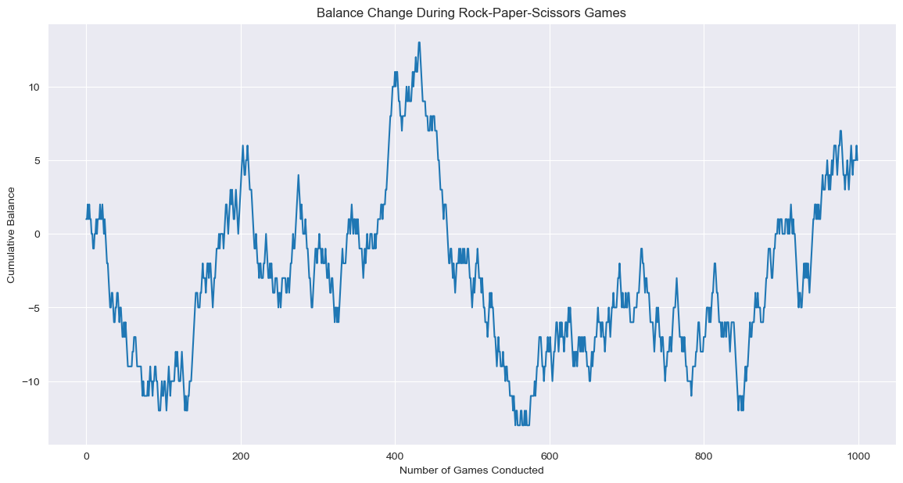
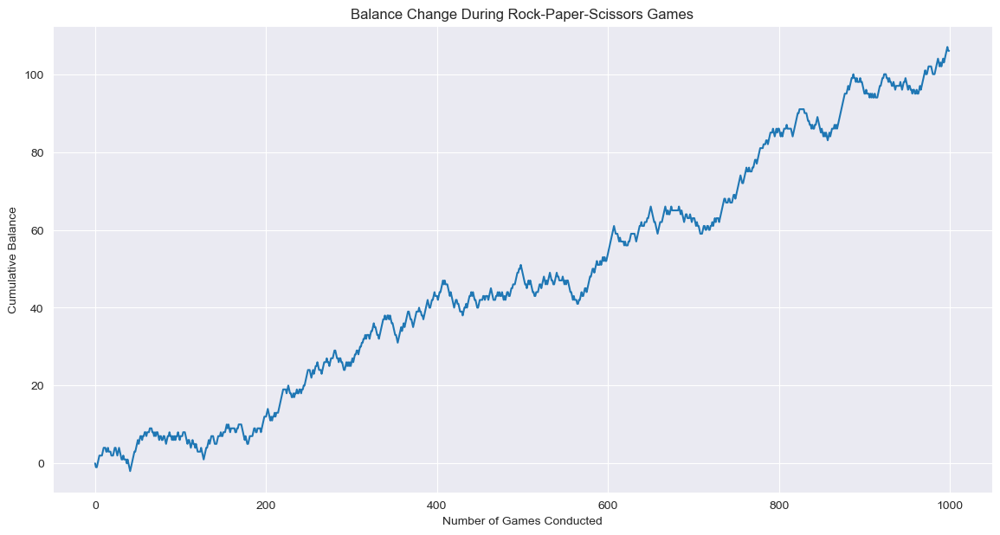
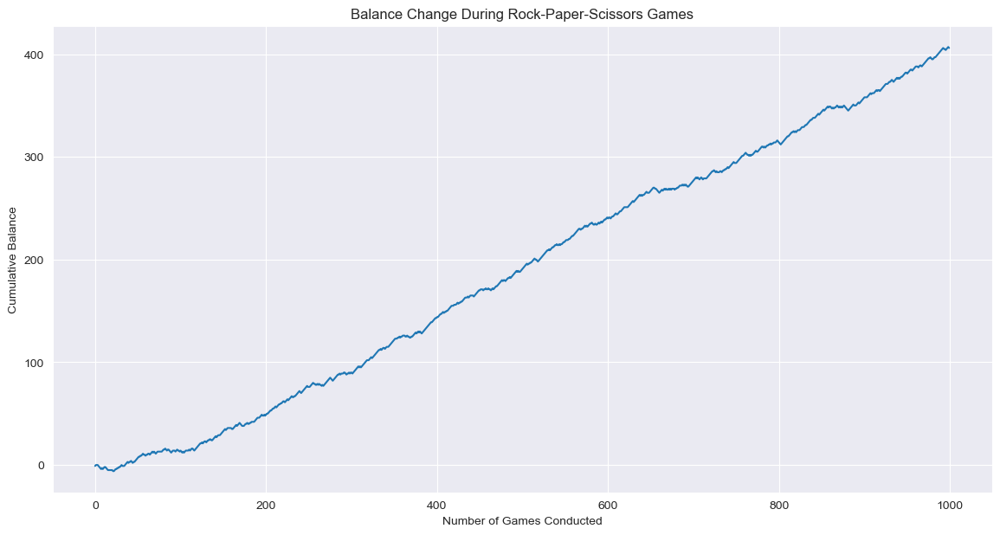

# Rock-Paper-Scissors Markov Chains Model

## Introduction
This repository houses a predictive Markov chain model for the classic game of rock-paper-scissors. The model's objective is to forecast an opponent's moves and evolve a counter-strategy, thus simulating a strategic game environment. The theoretical basis of the model lies in the assumption that the opponent's current move is dependent solely on their last move, not on a longer sequence of past moves.

## Concept and Strategy
The strategy used in this model is to record the opponent's move transitions and develop a probability matrix, which is then used to predict future moves. As the game progresses, this matrix evolves, reflecting the increasing information about the opponent's strategy. The model makes its predictions and adjusts its strategy accordingly, seeking to maximize its wins over a series of games.

## Observations
These visualizations illustrate the model's adaptability across different levels of opponent unpredictability:

### High Entropy ###
**Opponent strategy**: `[1/3, 1/3, 1/3]`

**Description**: This graph represents the model's performance in a highly entropic setting, where the opponent's behavior is equivalent to random guessing.  

### Normal Entropy ###
**Opponent strategy**: `[0.1, 0.5, 0.4]`

**Description**: This graph depicts the balance where the opponent's moves follow a certain patterns, but also include a decent variation, allowing for moderate predictability.

### Low Entropy ###
**Opponent strategy**: `[0.8, 0.1, 0.1]`

**Description**: This graph shows the model's performance against a highly predictable opponent, which results in a steady gain in balance over time.

## Conclusion
This model serves as a fascinating case study in applying Markov chains to game strategy. It illustrates how predictive analytics can be used even in scenarios with inherent randomness. 
